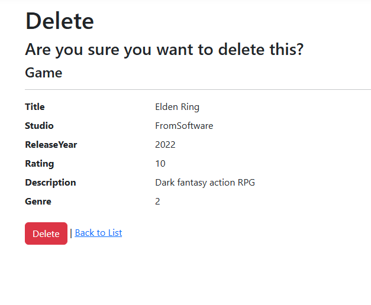
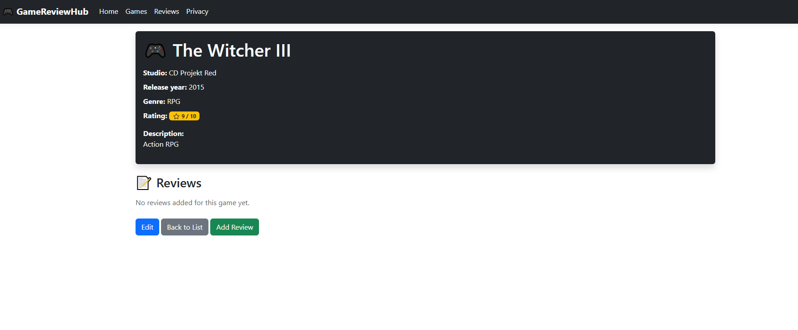
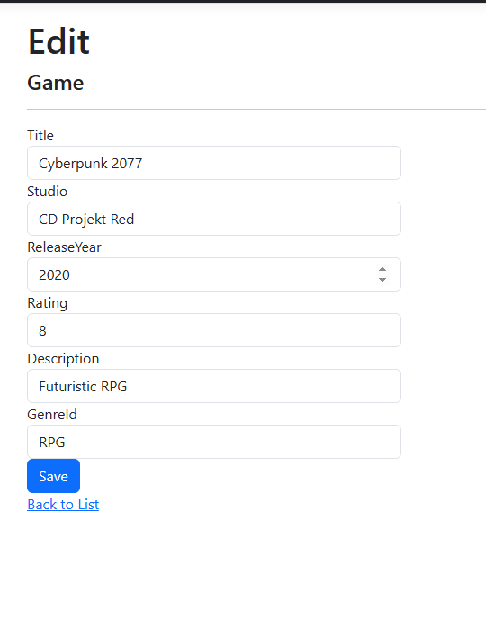
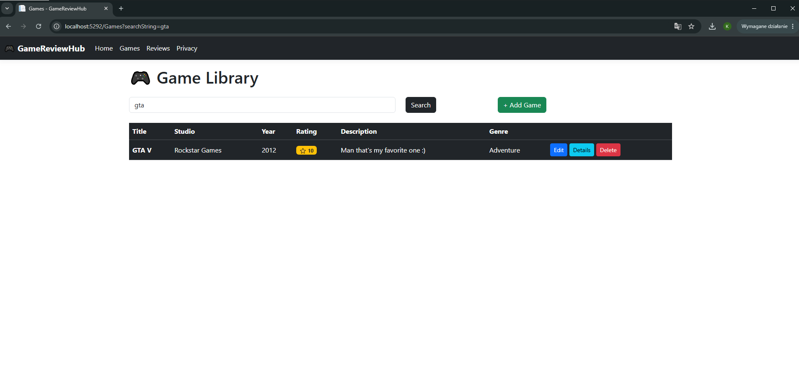
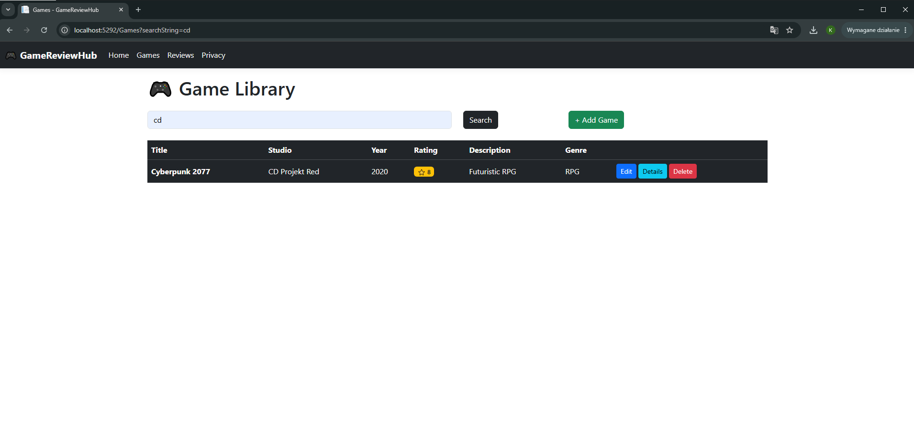
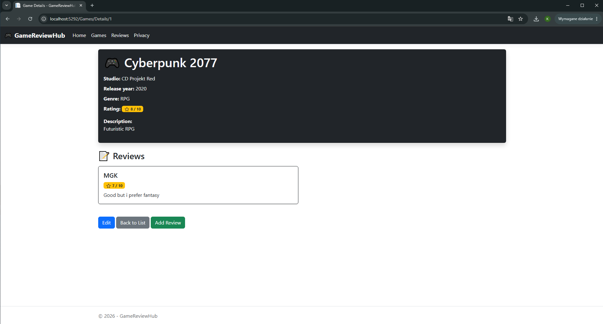
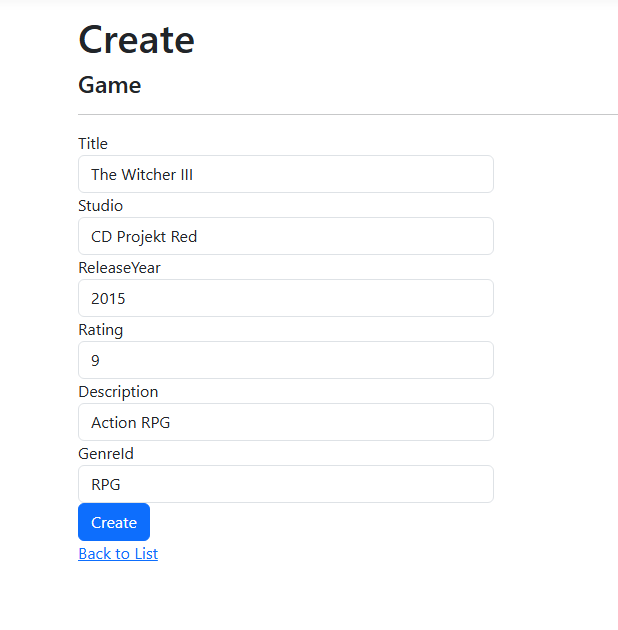
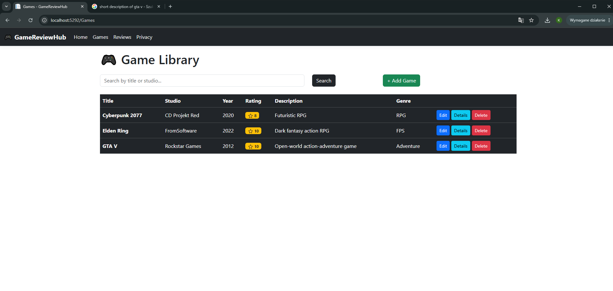
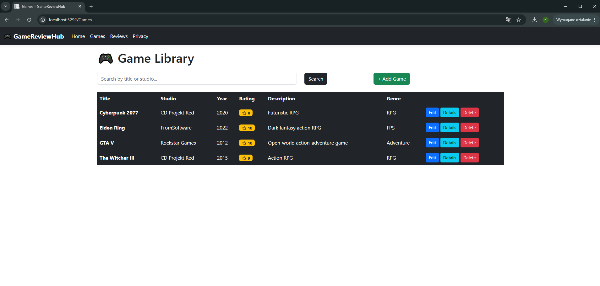

# GameReviewHub

GameReviewHub to aplikacja internetowa stworzona w technologii ASP.NET Core MVC.  
Projekt umożliwia dodawanie, przeglądanie oraz ocenianie gier komputerowych.

---

# Opis projektu

Aplikacja została wykonana w ramach projektu laboratoryjnego z wykorzystaniem wzorca MVC.

Użytkownik może:
-dodawać gry
-edytować gry
-usuwać gry
-przeglądać szczegóły gier
-dodawać recenzje
-wyszukiwać gry po nazwie lub studiu
-przypisywać gry do gatunków

Projekt wykorzystuje bazę danych SQLite oraz Entity Framework Core.

---

# Wykorzystane technologie

-ASP.NET Core MVC
-Entity Framework Core
-SQLite
-Bootstrap 5
-C#

---

# Funkcjonalności

## Gry
-dodawanie gier,
-edycja gier,
-usuwanie gier,
-podgląd szczegółów gry,
-wyszukiwanie gier.

## Recenzje
-dodawanie recenzji,
-edycja recenzji,
-usuwanie recenzji,
-przypisywanie recenzji do konkretnej gry.

## Dodatkowe funkcjonalności
-walidacja formularzy,
-relacje między modelami,
-wykorzystanie bazy danych SQLite,
-stylizacja Bootstrap,
-wyszukiwarka gier.

---

# Modele

## Game
-Title
-Studio
-ReleaseYear
-Rating
-Description
-Genre

## Genre
-Name

## Review
-Author
-Comment
-Score
-Assigned Game

---

# Uruchomienie projektu

## 1. Sklonowanie repozytorium
git clone LINK_DO_REPOZYTORIUM

## 2. Wejście do folderu projektu
cd GameReviewHub

## 3. Przywrócenie pakietów
dotnet restore

## 4. Uruchomienie aplikacji
dotnet run

## 5. Otworzenie aplikacji w przeglądarce
http://localhost:5292

---

# Struktura MVC

## Models
Folder `Models/` zawiera modele danych aplikacji, takie jak:
-Game
-Genre
-Review

## Controllers
Folder `Controllers/` zawiera kontrolery odpowiedzialne za obsługę logiki aplikacji i żądań HTTP:
-GamesController
-ReviewsController

## Views
Folder `Views/` zawiera widoki odpowiedzialne za interfejs użytkownika.

---

# Screeny aplikacji

---

# Autor
Sebastian Serafin 67486